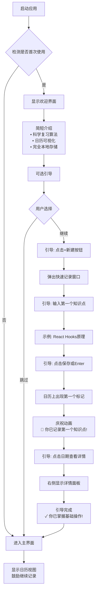
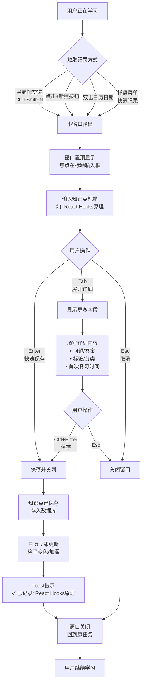
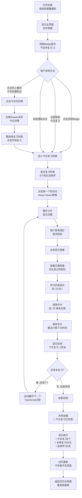
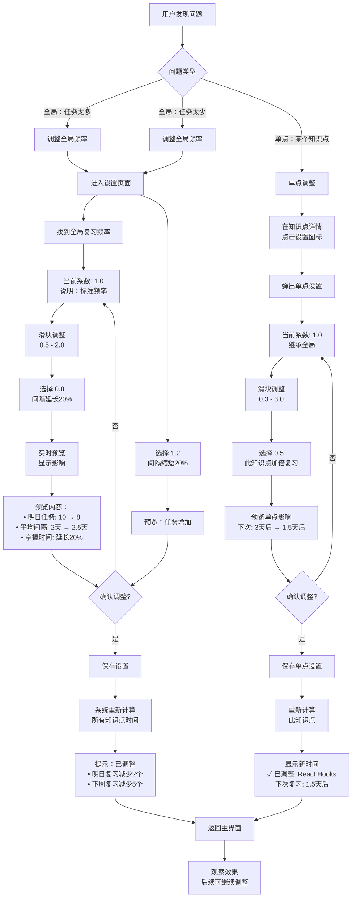

# UX Design Specification MindReminder

**Author:** Administrator
**Date:** 2025-12-13

---

## Executive Summary

### Project Vision

MindReminder 是一款桌面端个人成长中枢，旨在解决知识学习者"学了就忘"的核心痛点。产品通过科学的间隔重复算法、直观的日历式可视化界面，以及将知识点、日记、提醒三合一的整合设计，帮助用户建立持久的学习习惯并真正掌握知识。

产品的核心 UX 理念是"让记忆管理变得可视化、可掌控、有成就感"——用户能够清晰看到自己的学习轨迹，掌控复习节奏，并通过数据反馈获得持续的激励。

### Target Users

**主要用户群体 1：在校大学生（如李明）**
- **背景**：正在准备考研和找实习的大学生，主要在电脑前学习
- **核心需求**：系统化记录和复习大量专业知识点
- **痛点**：学了就忘，考前不知道该复习什么，缺乏学习掌控感
- **使用场景**：学习后立即记录 → 每晚固定时间复习 → 考前系统回顾
- **成功标准**：考试时能想起复习过的知识点，真正掌握技能

**主要用户群体 2：职场技能提升者（如王芳）**
- **背景**：工作3年的职场人士，准备跳槽面试，需要记忆大量"八股文"
- **核心需求**：在有限时间内高效记忆和复习面试知识点
- **痛点**：内容枯燥易忘，面试时担心突然想不起来，缺乏信心
- **使用场景**：晚上深度学习 → 碎片化复习 → 面试前快速回顾
- **成功标准**：面试时能流畅回答，拿到心仪的 Offer

**用户共性**：
- 主要在电脑前学习和工作（桌面应用优先）
- 技术熟练度高，期望工具简单直接
- 需要看到学习成果的可视化来获得动力
- 希望复习提醒是"友好督促"而非额外压力

### Key Design Challenges

**1. 复杂性与易用性的平衡**
- **挑战**：产品功能强大（可调复习算法、三合一功能、详细统计），但必须让新用户能在5分钟内上手
- **UX 策略**：渐进式披露（Progressive Disclosure）+ 智能默认值 + 可选的快速入门指导
- **关键决策点**：哪些功能前置？哪些功能隐藏在设置中？

**2. 信息密度与清晰度**
- **挑战**：日历需要同时展示知识点、日记、提醒三种内容类型，还要显示"下次复习时间"等元信息
- **UX 策略**：清晰的视觉分类系统（颜色、图标、样式）+ 可切换的视图模式 + 悬浮详情
- **关键决策点**：如何在不拥挤的前提下展示丰富信息？

**3. 即时性与深度功能的平衡**
- **挑战**：既要支持快速记录（快捷键、小窗口），又要提供详细的复习历史、统计分析等深度功能
- **UX 策略**：多层级信息架构 + 快捷操作路径 + 独立的统计和详情页面
- **关键决策点**：如何设计流畅的快速操作流程，同时不隐藏深度功能？

**4. 个性化与默认体验**
- **挑战**：算法高度可定制（全局系数、单点系数、记忆标准），但不能让用户感到必须配置才能使用
- **UX 策略**：开箱即用的智能默认值 + 后置的高级设置 + 情境化的调整入口
- **关键决策点**：默认参数如何设置？何时引导用户进行个性化调整？

### Design Opportunities

**1. 日历可视化创造情感连接**
- **机会**：通过视觉化完整学习历程，让用户产生"原来我学了这么多"的成就感
- **差异化价值**：这是与 Anki 等传统工具的核心差异，可以创造独特的"啊哈时刻"
- **UX 设计重点**：日历视图的视觉设计、交互细节、信息呈现方式是产品体验的关键

**2. 人性化评分降低心理负担**
- **机会**：表情符号评分（😟 忘记了 → 🎯 非常熟悉）比传统数字评分更友好、更直观
- **体验提升**：将复习从"考试压力"转变为"轻松自我对话"
- **UX 设计重点**：评分界面的设计、表情的选择、评分流程的流畅度

**3. 三合一整合创造使用粘性**
- **机会**：成为学习生活的"唯一入口"，避免在多个工具间切换
- **价值主张**：某一天的完整状态回顾（学了什么、做了什么、想了什么）
- **UX 设计重点**：如何在统一界面中优雅地整合三种内容类型，既统一又有区分

**4. 桌面端原生体验优势**
- **机会**：充分利用桌面平台的能力（快捷键、系统托盘、通知、多窗口）
- **竞争优势**：提供移动端和 Web 端无法实现的流畅体验
- **UX 设计重点**：系统集成（快捷键、托盘菜单）和多窗口交互设计

## Core User Experience

### Defining Experience

MindReminder 的核心体验围绕"让科学复习变得轻松且有成就感"展开。产品的核心操作循环是：**记录知识点 → 查看复习任务 → 完成复习并评分 → 查看学习历程**。

**最关键的用户行为：**
- **查看并完成每日复习任务**：这是产品价值的核心体现，必须做到科学且轻松
- **快速记录新知识点**：学习后立即记录，不打断学习流
- **浏览日历查看学习历程**：通过可视化获得成就感和动力

**核心体验目标：**
如果只能做对一件事，那就是**"让复习过程既科学又轻松"**。用户能轻松完成每日复习任务，通过人性化评分（😟→🎯）感受到进步，而不是感到压力。复习提醒应该是"友好的督促"，而不是额外负担。

### Platform Strategy

**主要平台：桌面应用（Electron）**
- **目标平台**：Windows 和 macOS
- **输入方式**：鼠标/键盘为主，重度依赖快捷键操作
- **使用场景**：主要在电脑前学习和工作的场景

**平台能力充分利用：**
- **系统集成**：系统托盘、全局快捷键、桌面通知
- **多窗口支持**：主窗口（完整功能）+ 快速记录小窗口（快捷记录）
- **离线优先**：MVP 阶段完全本地存储，无需联网
- **原生体验**：充分利用桌面端的性能和交互优势

**未来演进：**
- 阶段2：跨设备云端同步（多台桌面设备）
- 阶段3：移动端应用（iOS/Android，侧重通知和碎片化复习）

### Effortless Interactions

**应该完全无感的核心操作：**

1. **快速记录知识点（< 10秒完成）**
   - 全局快捷键（Ctrl/Cmd + Shift + N）→ 小窗口弹出
   - 输入知识点标题 → Enter 保存并关闭
   - 不打断当前学习流，记录后立即回到原任务

2. **查看今日复习任务（0 步导航）**
   - 打开应用即显示"今日待复习"任务列表
   - 无需点击菜单、无需搜索、无需配置

3. **完成复习评分（1 次点击）**
   - 点击表情符号（😟🤔😐😊🎯）即完成评分
   - 无需输入文字、无需确认对话框
   - 系统自动计算下次复习时间

4. **日历浏览历史（即时反馈）**
   - 点击日期立即展开当日详情
   - 悬浮显示摘要信息（无需点击）
   - 流畅的月份切换和年度浏览

**自动化的智能行为（零用户操作）：**
- 算法自动计算每个知识点的下次复习时间
- 自动判断是否达到记忆标准，触发长期抽查
- 每日自动备份数据到本地
- 复习提醒自动推送（用户可配置时间）

**零学习成本的设计：**
- 表情符号评分：直觉理解，无需说明
- 日历界面：利用熟悉的日历隐喻
- 问题形式记录：符合自然的思维方式

### Critical Success Moments

**"啊哈时刻"（用户意识到产品价值）：**

**第一周 - 习惯建立的成就感**
- **时刻**：用户看到日历上连续7天的学习记录
- **情感**："我真的在坚持！我有学习轨迹了！"
- **设计重点**：日历上的连续记录需要视觉上有连贯性和仪式感

**第二周 - 价值验证的惊喜**
- **时刻**：复习时发现真的记住了之前容易忘的内容，自评从😟提升到😊或🎯
- **情感**："科学复习真的有效！这个工具帮到我了！"
- **设计重点**：评分历史要清晰展示进步趋势

**第一个月 - 成果积累的震撼**
- **时刻**：通过日历回顾发现记录了几十上百个知识点
- **情感**："原来我已经学了这么多！"
- **设计重点**：月度统计和日历全览要有视觉冲击力

**考试/面试 - 最终价值的验证**
- **时刻**：在关键场合（考试/面试）想起并应用了复习过的知识点
- **情感**："真的用上了！这个工具改变了我的学习方式！"
- **设计重点**：考前/面试前的系统回顾功能要强大

**可能失败的关键时刻（需要预防）：**
- **首次使用**：找不到记录入口 → 需要明显的主要 CTA 和可选的快速指引
- **复习负担**：任务太多感到压力 → 需要智能默认算法和灵活的频率调整
- **复杂配置**：看不懂设置选项 → 需要渐进式披露和情境化帮助
- **数据安全**：担心数据丢失 → 需要自动备份和明确的安全提示

### Experience Principles

以下五大原则将指导所有 UX 设计决策：

**1. "记录即刻，复习轻松"（Capture Fast, Review Easy）**
- 快速记录不打断学习流（全局快捷键 + 小窗口）
- 复习过程友好不压力（表情评分 + 清晰任务列表）
- 每个操作都要追求最少步骤、最快速度

**2. "可视即掌控"（Visibility Creates Control）**
- 通过日历让学习历程完全可视化
- 让用户始终清楚"学了什么"、"还要复习什么"、"何时能掌握"
- 可视化不只是数据展示，更是情感激励

**3. "简单开始，深度可选"（Simple Start, Power Available）**
- 开箱即用，智能默认值，无需配置即可使用
- 高级功能通过渐进式披露呈现
- 新手5分钟上手，高级用户找到深度控制

**4. "科学但人性化"（Scientific Yet Human）**
- 算法基于科学（艾宾浩斯遗忘曲线）
- 交互充满人性（表情评分、友好提醒、成就反馈）
- 让科学工具有温度，让用户感到被理解

**5. "一站式成长中枢"（Unified Growth Hub）**
- 知识+日记+提醒统一管理
- 减少工具切换，提升专注和效率
- 形成完整的个人成长档案

## Desired Emotional Response

### Primary Emotional Goals

MindReminder 的核心情感目标是让用户在学习和复习过程中感到**掌控、成就、轻松**。与传统记忆工具的严肃和系统化不同，MindReminder 追求"科学但温暖"的情感基调——用户既能感受到间隔重复算法的科学力量，又能享受人性化交互带来的轻松友好。

**主要情感：**

**掌控感（Empowered & In Control）**
- 用户能清晰看到学习进度和复习计划
- 通过日历可视化掌握完整的学习历程
- 灵活调整复习频率，而非被工具控制
- 始终知道"我学了什么"和"还要复习什么"

**成就感（Accomplished）**
- 通过日历看到连续的学习记录
- 评分从😟提升到🎯的进步可视化
- 统计数据展示积累的知识点数量
- 考试/面试时真的用上了记住的知识

**轻松感（Ease & Comfort）**
- 表情符号评分降低心理压力
- 快速记录不打断学习流
- 复习提醒是"友好督促"而非负担
- 界面语言温暖、鼓励而非严肃

**差异化情感定位：**
传统工具（如 Anki）让用户感到"严肃、系统化但有压力"，MindReminder 让用户感到"科学但轻松、有序但温暖、高效但人性化"。

### Emotional Journey Mapping

**首次发现 → 好奇与希望**
- **目标情感**：这可能是我一直在寻找的工具
- **设计策略**：清晰的价值主张、视觉吸引力、可选的快速入门
- **避免情感**：怀疑（"又一个记忆工具"）、复杂感

**开始使用 → 信心与流畅**
- **目标情感**：我知道怎么用，很简单
- **设计策略**：明显的主要操作入口、智能默认值、即时反馈
- **避免情感**：困惑（"不知道从哪开始"）、挫败

**核心操作（记录和复习）→ 轻松与被理解**
- **目标情感**：这个过程很自然，工具懂我
- **设计策略**：快捷键、表情评分、无需确认的流畅交互
- **避免情感**：压力（"任务太多"）、机械感

**完成任务 → 满足与成就**
- **目标情感**：我做到了，我在进步
- **设计策略**：完成反馈、进度展示、正向激励文案
- **避免情感**：疲惫、空虚感

**出错或问题 → 理解与信任**
- **目标情感**：系统会帮我，数据是安全的
- **设计策略**：友好的错误提示、自动备份、数据恢复
- **避免情感**：恐慌（"数据丢了"）、愤怒、放弃

**长期使用 → 归属与期待**
- **目标情感**：这是我学习生活的一部分，我期待每天使用
- **设计策略**：个人成长档案、可回顾历史、个性化设置
- **避免情感**：厌倦、无聊、习惯性忽略

### Micro-Emotions

**关键微情感状态及设计响应：**

**信心 vs. 困惑**
- **目标**：用户始终清楚下一步该做什么
- **关键时刻**：首次使用、查看复习任务、调整高级设置
- **设计响应**：明确的视觉层级、情境化帮助、清晰的标签和说明

**成就 vs. 挫败**
- **目标**：让用户清晰看到进步和成长
- **关键时刻**：复习评分提升、日历回顾、月度统计
- **设计响应**：评分趋势可视化、连续记录的视觉连贯性、里程碑庆祝

**轻松 vs. 焦虑**
- **目标**：复习是愉快的习惯而非压力负担
- **关键时刻**：看到任务数量、接收提醒、评分过程
- **设计响应**：合理的默认算法、表情评分、友好的提醒文案

**掌控 vs. 失控**
- **目标**：用户能灵活调整复习策略
- **关键时刻**：任务太多/太少、需要调整节奏
- **设计响应**：可见的频率系数调整、情境化的设置入口、实时预览效果

**信任 vs. 怀疑**
- **目标**：用户相信算法有效且数据安全
- **关键时刻**：数据存储、算法决策、导出备份
- **设计响应**：自动备份提示、算法逻辑透明化、清晰的隐私承诺

**归属 vs. 孤立**
- **目标**：工具成为学习生活的温暖伙伴
- **关键时刻**：长期使用、回顾历史、日常习惯
- **设计响应**：个人成长档案、温暖的界面语言、个性化体验

### Design Implications

**情感目标与 UX 设计的具体连接：**

**为了创造"掌控感"：**
- ✅ 日历可视化让所有信息一目了然（过去、现在、未来）
- ✅ 每个知识点显示"下次复习时间"
- ✅ 灵活的复习频率系数调整（全局 + 单点）
- ✅ 可自定义记忆标准
- ✅ 清晰的任务列表和完成状态

**为了创造"成就感"：**
- ✅ 日历上连续学习记录的视觉连贯性（如连续打卡）
- ✅ 评分进步趋势的清晰展示（😟→😊→🎯）
- ✅ 统计数据的正向表达（"已记录X个知识点"）
- ✅ 里程碑时刻的庆祝（如第7天、第30天、达到记忆标准）
- ✅ 月度/年度回顾的视觉冲击力

**为了创造"轻松感"：**
- ✅ 表情符号替代数字评分，降低心理负担
- ✅ 全局快捷键实现快速记录（< 10秒）
- ✅ 一键完成评分，无需确认对话框
- ✅ 智能默认值，无需配置即可使用
- ✅ 友好鼓励的界面文案（"今天做得很棒！"）

**为了创造"信任感"：**
- ✅ 每日自动备份并提示用户
- ✅ 算法逻辑的透明展示（如"基于艾宾浩斯遗忘曲线"）
- ✅ 数据导出/导入功能易于访问
- ✅ 清晰的本地存储说明和隐私承诺

**为了创造"归属感"：**
- ✅ 三合一设计形成完整的个人成长档案
- ✅ 可回顾任何一天的完整状态（学了什么、做了什么、想了什么）
- ✅ 个性化设置持久保存
- ✅ 温暖的界面语言，像朋友而非冰冷工具

### Emotional Design Principles

**指导所有情感设计决策的核心原则：**

**1. "温暖而非冰冷"（Warm, Not Cold）**
- 使用友好鼓励的语言而非严肃指令
- 表情符号和视觉元素带来温度
- 庆祝用户的进步和成就
- 让科学工具有人性关怀

**2. "支持而非评判"（Supportive, Not Judgmental）**
- 评分是自我对话而非考试
- 复习提醒是友好督促而非压力
- 即使评分低（😟）也给予鼓励
- 灵活调整而非强制执行

**3. "透明而非神秘"（Transparent, Not Mysterious）**
- 算法逻辑清晰可见
- 为什么要复习、何时能掌握都有说明
- 数据完全可控可导出
- 用户始终知道发生了什么

**4. "激励而非打击"（Motivating, Not Discouraging）**
- 强调进步而非缺陷
- 可视化成长轨迹
- 正向表达（"已完成X个"而非"还剩Y个"）
- 小成就的及时反馈

**5. "陪伴而非工具"（Companion, Not Just Tool）**
- 成为学习生活的一部分
- 记录完整的成长历程
- 长期陪伴而非短期使用
- 建立情感连接和习惯依赖

## UX Pattern Analysis & Inspiration

### Inspiring Products Analysis

基于 MindReminder 的核心特性（日历可视化 + 记忆管理 + 习惯养成 + 桌面体验），以下产品提供了最具启发性的 UX 模式：

**Google Calendar - 日历可视化标杆**

Google Calendar 是全球最成功的日历产品，为 MindReminder 的日历核心界面提供重要参考。

**UX 成功之处：**
- **信息密度处理得当**：在有限空间内展示大量事件但不拥挤，通过颜色编码快速区分类型
- **多视图灵活切换**：日/周/月/年视图满足不同需求，切换流畅快速
- **快速操作设计**：双击创建事件、拖拽调整时间、完整的快捷键支持
- **视觉层级清晰**：今天/过去/未来有明确视觉区分，当前时间线清晰可见
- **悬浮预览机制**：悬浮显示摘要，点击展开详情，信息分层合理

**对 MindReminder 的启发：**
- 采用颜色编码区分知识点、日记、提醒三种内容类型
- 提供月视图、周视图、列表视图的灵活切换
- 悬浮预览知识点摘要，点击展开完整详情
- 双击日期快速创建知识点
- 清晰的视觉时间线区分过去、今天、未来

---

**GitHub Contribution Graph - 成就感可视化**

GitHub 的贡献热力图是最成功的成就可视化案例，通过极简设计创造强大的激励效果。

**UX 成功之处：**
- **极简但有力的可视化**：一年活动浓缩在一屏，颜色深浅直观展示活跃度
- **即时反馈与激励**：每次提交立即反映，连续打卡视觉冲击力强
- **社交驱动力**：Streak（连续天数）成为荣誉勋章
- **渐进式详情**：悬浮显示数字，点击查看详细活动
- **连续性强化**：连续的深色格子创造成就感，空白产生可见损失

**对 MindReminder 的启发：**
- 日历格子用颜色深浅表示当日学习强度（记录和复习数量）
- 连续学习的日子用视觉连贯性表达，强化"连击"感
- 年度总览让用户一屏看到全年学习轨迹
- 里程碑庆祝：连续 7 天、30 天等给予特殊视觉反馈
- 渐进式信息展示：悬浮→点击→展开详情

---

**Things (macOS) - 优雅的任务管理**

Things 是 macOS 平台最优雅的生产力工具，为桌面端体验提供卓越范例。

**UX 成功之处：**
- **极致的简洁与流畅**：界面极简但不简陋，动画流畅自然，每个交互都有愉悦感
- **智能的信息架构**："今天"、"即将到来"、"待整理"逻辑清晰，项目和标签灵活组织
- **快速捕获体验**：全局快捷键弹出 Quick Entry，输入即保存，自然语言解析
- **完成时的仪式感**：完成任务的动画反馈、划掉的满足感、已完成列表可回顾
- **极简美学**：留白与信息密度平衡完美，键盘操作丝滑

**对 MindReminder 的启发：**
- 全局快捷键弹出快速记录小窗口，输入即保存
- 流畅的动画反馈让每个交互都有愉悦感
- 清晰的信息架构："今日复习"、"所有知识点"、"日历视图"
- 完成复习时的视觉反馈和仪式感
- 留白与信息密度的平衡，打造极简美学

---

**Forest - 习惯养成与正向激励**

Forest 在习惯养成和正向激励方面极为成功，为 MindReminder 的激励机制提供灵感。

**UX 成功之处：**
- **游戏化激励机制**：每次专注种一棵树，连续使用形成森林，产生"损失厌恶"心理
- **正向反馈设计**：强调"已完成"而非"未完成"，成就统计正向呈现
- **长期激励**：森林持续生长产生归属感，真实环保行动增加意义感
- **温暖的视觉语言**：柔和的颜色、可爱的插画、鼓励性文案，界面充满生命力
- **里程碑奖励**：种植 X 棵树时的成就解锁

**对 MindReminder 的启发：**
- 学习记录形成视觉化的"成长图谱"（类似森林）
- 正向表达："已记录 X 个知识点"而非"还剩 Y 个"
- 连续学习/复习的视觉强化和激励
- 里程碑庆祝：第 7 天、30 天、100 个知识点等
- 柔和的配色、友好的文案，打造温暖的视觉

### Transferable UX Patterns

从以上优秀产品中提取以下可应用于 MindReminder 的 UX 模式：

**导航与信息架构模式：**

**三栏式布局（借鉴 Things）**
- **左侧导航**：今日复习、所有知识点、日历、日记、统计
- **中间内容**：列表或日历视图
- **右侧详情**：选中项的详细信息和操作
- **优势**：信息层级清晰，适合桌面端大屏幕

**智能筛选与搜索（借鉴 Google Calendar + Things）**
- **快速筛选**：今天、本周、已掌握、待复习
- **标签筛选**：按分类快速定位知识点
- **搜索即筛选**：输入即实时过滤结果
- **组合筛选**：多条件组合（如"本周 + 编程类 + 待复习"）

**日历可视化模式：**

**多密度视图（借鉴 Google Calendar）**
- **月视图**：鸟瞰全局，用点/颜色表示活动密度
- **周视图**：查看细节，显示具体任务和时间
- **列表视图**：专注操作，逐项复习知识点
- **优势**：满足不同场景的信息需求

**热力图增强（借鉴 GitHub）**
- **颜色深浅编码**：日历格子颜色表示当日学习强度
- **悬浮统计**：悬浮显示"新增 X 个，复习 Y 个"
- **连续性视觉**：连续学习的格子视觉连贯，产生"连击"感
- **年度总览**：一屏展示全年学习轨迹，震撼的成就感

**交互模式：**

**快速捕获模式（借鉴 Things）**
- **全局快捷键**：Ctrl/Cmd+Shift+N 弹出小窗口
- **窗口特性**：始终置顶，焦点在输入框
- **快捷操作**：Enter 保存并关闭，Esc 取消关闭
- **自然语言**：支持"明天复习"自动设置时间（可选功能）

**所见即所得操作（借鉴 Google Calendar）**
- **直接拖拽**：日历上拖拽知识点调整复习时间
- **双击创建**：双击日期快速创建知识点
- **右键菜单**：提供快捷操作（编辑、删除、调整）
- **即时反馈**：操作立即生效，无需确认

**一键完成模式（借鉴 Things）**
- **评分一键完成**：点击表情符号即完成，无确认对话框
- **流畅动画**：完成时的动画反馈
- **即时更新**：自动计算并显示下次复习时间

**视觉反馈模式：**

**进度可视化（借鉴 GitHub + Forest）**
- **热力图**：日历展示学习强度和活跃度
- **连续性强化**：连续学习的视觉连贯性（类似 GitHub Streak）
- **成长隐喻**：知识点积累像森林茂盛，视觉化成长过程
- **趋势展示**：评分从 😟 到 🎯 的进步趋势可视化

**里程碑庆祝（借鉴 Forest）**
- **连续 7 天**：小成就动画 + 鼓励文案（"坚持一周！继续加油！"）
- **连续 30 天**：大成就动画 + 特殊徽章
- **记录 100 个知识点**：庆祝弹窗 + 统计展示
- **掌握 50 个知识点**：成就解锁 + 正向激励

**完成仪式感（借鉴 Things）**
- **复习完成动画**：划掉动画、闪烁效果
- **达到记忆标准**：特殊的完成动画和音效（可选）
- **每日任务完成**："今日复习已完成✓"的满足感反馈
- **成就回顾**：已完成列表可随时查看

### Anti-Patterns to Avoid

从竞品和类似产品的失败经验中学习，避免以下 UX 反模式：

**反模式 1：过度游戏化**
- **问题**：像 Habitica 过多游戏元素（金币、装备、角色）分散注意力，失去专业感
- **教训**：MindReminder 应保持学习工具的专业定位
- **策略**：适度游戏化（表情评分、成就庆祝）但不过度娱乐化
- **平衡点**：正向激励但不让用户感觉在"玩游戏"

**反模式 2：复杂的配置要求**
- **问题**：Anki 需要大量配置才能使用，学习曲线陡峭，新用户流失率高
- **教训**：智能默认值，让用户立即上手
- **策略**：开箱即用，高级设置渐进式披露
- **目标**：新用户 5 分钟内完成第一次复习

**反模式 3：信息过载**
- **问题**：Notion 功能强大但信息架构复杂，新用户迷失方向
- **教训**：日历作为核心入口，信息分层清晰
- **策略**：渐进式披露，逐步展示深度功能
- **原则**：每个界面只聚焦一个主要任务

**反模式 4：冷冰冰的工具感**
- **问题**：传统记忆工具纯功能导向，缺乏情感连接，用户难以建立长期习惯
- **教训**：温暖的视觉、友好的文案、人性化的交互
- **策略**：让工具有温度，像朋友而非机器
- **目标**：用户感到被理解和支持

**反模式 5：强制中断工作流**
- **问题**：某些提醒工具的通知打断工作流，产生反感甚至被禁用
- **教训**：复习提醒友好不强制，可配置
- **策略**：轻量级通知，用户可选择最佳时间
- **原则**："友好督促"而非"强制打断"

### Design Inspiration Strategy

**直接采用的模式：**

✅ **Google Calendar 的颜色编码**：知识点（蓝色）、日记（绿色）、提醒（橙色）  
✅ **GitHub 的热力图可视化**：学习强度用颜色深浅表达  
✅ **Things 的快速捕获**：全局快捷键 + 小窗口 + 输入即保存  
✅ **Forest 的连续激励**：连续学习的视觉强化和里程碑庆祝  
✅ **Things 的流畅动画**：每个交互都有恰当的动画反馈  

**改编应用的模式：**

🔄 **Google Calendar 的拖拽操作**：简化为调整复习时间，不支持任意位置拖动  
🔄 **Things 的项目组织**：改为更灵活的标签/分类系统  
🔄 **Forest 的游戏化元素**：只保留视觉化成就，去掉虚拟货币等过度游戏化  
🔄 **GitHub 的社交驱动**：个人使用为主，暂不考虑社交功能（MVP 阶段）  

**明确避免的模式：**

❌ **Notion 的块编辑器**：过于复杂，不适合快速记录场景  
❌ **Habitica 的角色扮演**：过度游戏化，不符合学习工具定位  
❌ **Anki 的复杂配置界面**：学习曲线陡峭，与易用性目标冲突  
❌ **某些日历的订阅机制**：MVP 阶段不需要，增加复杂度  

**MindReminder 的独特创新：**

💡 **表情符号评分系统**：比传统数字评分更人性化的创新（😟→🎯）  
💡 **三合一个人成长档案**：知识点 + 日记 + 提醒的独特整合  
💡 **可调复习频率系数**：全局 + 单点的灵活控制，业界首创  
💡 **预测性记忆进度**：告诉用户"何时能真正记住"，而非只是提醒复习  

**设计执行策略：**

**阶段 1（核心体验）：**
- 优先实现日历可视化 + 热力图（借鉴 Google Calendar + GitHub）
- 快速记录和评分流程（借鉴 Things）
- 基础的视觉反馈和动画

**阶段 2（体验优化）：**
- 完善里程碑庆祝机制（借鉴 Forest）
- 增强拖拽和快捷操作（借鉴 Google Calendar）
- 优化动画和微交互细节

**阶段 3（深度功能）：**
- 高级筛选和搜索
- 详细的统计和趋势分析
- 导出和备份功能

**持续原则：**
- 每个借鉴的模式都要根据 MindReminder 的独特场景调整
- 保持产品的核心差异化（日历可视化 + 人性化评分 + 灵活算法）
- 避免功能堆砌，专注核心体验的卓越

## Design System Foundation

### Design System Choice

**选择：Ant Design**

MindReminder 将采用 **Ant Design** 作为设计系统基础，这是一个为企业级桌面应用而生的 React UI 组件库。

**核心优势：**
- 专为桌面端设计，信息密度和交互模式完美匹配 MindReminder 的需求
- 组件库丰富完整（Calendar、Table、Form、Statistic 等开箱即用）
- React 生态成熟，与 Electron 技术栈无缝配合
- 中文文档优秀，社区活跃，问题解决效率高
- 专业可信赖的视觉风格，适合学习工具定位

### Rationale for Selection

**1. 桌面端原生适配**

Ant Design 是专为企业级桌面应用设计的，与 MindReminder 的桌面端定位完美契合：
- 信息密度优化：适合展示复杂的日历视图和知识点列表
- 交互模式：悬浮、点击、快捷键等交互都针对桌面优化
- 布局系统：支持三栏式布局等桌面端常见架构
- 非移动优先：不需要像 Material Design 那样从移动端适配到桌面

**2. 加速 MVP 交付（关键因素）**

在 3-4 个月的 MVP 时间线内，Ant Design 能显著加速开发：
- **日历组件**：内置强大的 Calendar 组件，是日历核心界面的理想起点
- **数据展示**：Table、List、Card 等组件适合知识点管理
- **表单系统**：Form 组件简化记录和编辑流程
- **统计组件**：Statistic、Progress 适合展示学习数据
- **布局框架**：Layout 组件快速搭建应用架构

**不选择自定义设计系统的原因：**
- 自定义设计系统可能占用 MVP 30-40% 的开发时间
- 小团队（2-3人）缺少专职 UI 设计师资源
- MVP 阶段应专注核心功能验证，而非 UI 组件开发

**不选择 Material UI 的原因：**
- Material Design 风格偏移动端，需要更多定制适配桌面
- 默认信息密度较低，不如 Ant Design 适合复杂数据展示
- 日历组件需要额外使用第三方库，增加集成复杂度

**不选择 Chakra UI 的原因：**
- 组件库不如 Ant Design 丰富（缺少日历、表格等核心组件）
- 需要更多自定义工作，不符合快速交付目标
- 不如 Ant Design 适合高信息密度的桌面应用

**3. 小团队友好**

Ant Design 降低团队的设计和开发门槛：
- 文档和示例完善，上手快速
- 中文文档质量高，降低语言障碍
- 社区活跃，遇到问题容易找到解决方案
- 不需要专职 UI 设计师也能做出专业界面

**4. 专业可信赖的视觉**

学习工具需要专业可信的视觉风格：
- Ant Design 视觉专业、成熟，符合学习工具的严肃定位
- 被阿里、腾讯等大厂广泛使用，用户熟悉度高
- 默认风格不会显得"玩具化"或"过于花哨"

**5. 技术生态兼容**

与 MindReminder 的技术栈完美配合：
- **React 支持**：原生为 React 设计
- **TypeScript**：完整的类型定义
- **Electron 兼容**：在桌面端环境运行良好
- **主题定制**：支持 Less/CSS-in-JS 主题定制
- **按需加载**：支持 Tree Shaking，优化包体积

### Implementation Approach

**阶段 1：基础设施搭建**

**安装和配置：**
```bash
npm install antd
npm install @ant-design/icons
```

**主题定制配置：**
- 定义品牌主色（建议蓝色系，传达"专业、科技、信赖"）
- 调整设计令牌（圆角、间距、字体大小）
- 配置 Less 变量或使用 ConfigProvider 动态主题

**基础布局搭建：**
- 使用 Layout 组件搭建三栏式架构
- 左侧导航：Sider + Menu
- 中间内容：Content + 动态组件
- 右侧详情：Drawer 或固定面板

**阶段 2：核心组件实现**

**直接使用的 Ant Design 组件：**

**日历与时间：**
- `Calendar` - 日历核心视图的基础
- `DatePicker` - 选择日期和时间
- `Timeline` - 显示复习历史时间线

**数据展示：**
- `Table` - 知识点列表和管理
- `List` - 简化的知识点列表
- `Card` - 知识点卡片展示
- `Statistic` - 统计数据展示
- `Progress` - 记忆进度展示
- `Badge` - 未读数量标记

**表单与输入：**
- `Form` - 记录和编辑知识点
- `Input` / `TextArea` - 文本输入
- `Select` - 分类和标签选择
- `Radio` - 单选（评分基础）
- `Button` - 各类操作按钮

**反馈与提示：**
- `Modal` - 快速记录小窗口
- `Drawer` - 侧边详情面板
- `Tooltip` - 悬浮提示
- `Popover` - 更丰富的悬浮内容
- `Message` - 操作反馈提示
- `Notification` - 桌面通知

**导航与布局：**
- `Layout` - 整体布局框架
- `Menu` - 左侧导航菜单
- `Tabs` - 视图切换
- `Dropdown` - 下拉菜单

**阶段 3：自定义组件开发**

基于 Ant Design 扩展或完全自定义的组件：

**表情符号评分组件：**
- 基于 `Radio.Group` 或 `Button.Group`
- 自定义样式，显示表情符号（😟🤔😐😊🎯）
- 一键点击完成评分，无确认对话框
- 流畅的动画反馈

**热力图日历增强：**
- 扩展 Ant Design `Calendar` 组件
- 添加颜色深浅编码（类似 GitHub）
- 悬浮显示当日统计
- 连续学习的视觉强化
- 支持年度总览视图

**记忆进度可视化：**
- 自定义进度组件（或基于 `Progress` 改造）
- 显示"预计X天后掌握"
- 视觉化评分趋势（😟→🎯）

**成就庆祝动画：**
- 自定义动画组件
- 里程碑达成时的庆祝效果
- 徽章和成就展示

**快速捕获窗口：**
- 基于 `Modal` 自定义
- 始终置顶、最小化设计
- 焦点管理和快捷键支持

### Customization Strategy

**主题定制方案：**

**品牌色定义：**
- **主色（Primary）**：蓝色系（#1890ff 或调整）- 知识点、主要操作
- **成功色（Success）**：绿色系 - 日记、已掌握状态
- **警告色（Warning）**：橙色系 - 提醒、待复习
- **辅助色**：根据情感设计原则选择温暖的配色

**设计令牌调整：**
- **圆角**：适度圆角（4-8px），现代但不过分可爱
- **间距**：保持 Ant Design 默认（8px 网格系统）
- **字体**：系统默认字体栈，确保中英文清晰
- **阴影**：柔和的阴影，增加层次但不过度

**视觉温暖化策略：**

虽然使用 Ant Design 的专业基础，但需要注入温暖元素：
- 使用柔和的配色而非纯黑白
- 按钮和卡片采用适度圆角
- 添加流畅的过渡动画
- 文案使用友好鼓励的语言
- 适当使用表情符号增加亲和力

**响应式与适配：**
- 针对桌面端分辨率优化（1280x720 最小，1920x1080 最佳）
- 支持窗口大小调整
- 保持合理的信息密度
- 考虑高 DPI 屏幕显示

**性能优化：**
- 按需加载组件（Tree Shaking）
- 虚拟滚动处理大列表（使用 `rc-virtual-list`）
- 日历组件性能优化（避免重复渲染）
- 动画使用 CSS 而非 JavaScript 动画

**可访问性保障：**
- 保持 Ant Design 内置的可访问性特性
- 完整的键盘导航支持
- 合理的焦点管理
- 清晰的视觉反馈

**实施时间表：**

**Week 1-2：基础设施**
- 安装配置 Ant Design
- 主题定制和品牌色定义
- 基础布局框架搭建

**Week 3-6：核心界面**
- 日历视图（基于 Calendar 扩展）
- 知识点列表和管理（Table/List）
- 快速记录和编辑（Form + Modal）

**Week 7-10：自定义组件**
- 表情评分组件
- 热力图增强
- 进度可视化
- 成就庆祝动画

**Week 11-12：优化与打磨**
- 动画和微交互细节
- 性能优化
- 跨平台测试（Windows + macOS）

**迭代策略：**
- MVP 阶段使用 Ant Design 默认样式快速验证功能
- 后续版本逐步定制和优化视觉
- 保持与 Ant Design 版本更新同步
- 记录自定义组件，便于未来维护

**风险缓解：**
- **升级风险**：锁定 Ant Design 大版本，避免破坏性更新
- **性能风险**：监控包体积，按需加载，优化渲染
- **定制限制**：如果 Ant Design 限制太大，可替换单个组件而非整个系统
- **学习曲线**：团队提前学习 Ant Design API 和最佳实践

## Defining the Core Experience

### The Defining Interaction

**MindReminder 的定义性体验：日历可视化让学习历程掌控在手**

每个成功的产品都有一个核心交互，如果做对了，其他一切都会跟着成功。对于 MindReminder，这个定义性体验是：

> **"通过日历可视化，让学习历程和复习计划变得清晰可见、可掌控"**

**为什么是日历可视化？**

在分析了三个候选核心体验后（日历可视化、复习评分、快速记录），日历可视化脱颖而出：

1. **差异化最强**：这是与 Anki 等传统记忆工具的根本区别
2. **情感共鸣最深**：用户的"啊哈时刻"发生在看到完整学习历程时
3. **价值直观体现**：可视化让抽象的"记忆管理"变得具体可触
4. **用户描述方式**：用户会说"这个应用能看到我的完整学习日历"

**用户体验的核心时刻：**

用户打开 MindReminder，首先映入眼帘的是日历视图——过去每一天的学习记录、未来每个知识点的复习时间、连续学习的视觉连贯性——这一刻，用户感到："我的学习完全在掌控之中。"

这不是一个普通的日历，而是一个**学习历程图谱**，让用户清晰看到：
- **过去**：我学了什么、坚持了多久（成就感）
- **现在**：今天要复习什么、学习状态如何（掌控感）
- **未来**：接下来的复习计划、何时能掌握（预期感）

### User Mental Model

**用户当前的问题解决方式：**

**传统方式（无工具）：**
- 笔记本记录知识点 → 忘记复习 → 考前临时抱佛脚
- **心智模型**：线性记录，缺少系统性
- **痛点**：不知道该复习什么、何时复习
- **情感**：焦虑、失控、挫败

**Anki/SuperMemo（记忆工具）：**
- 列表式任务队列 → 按顺序机械复习卡片
- **心智模型**：任务队列，执行清单
- **痛点**：看不到全局、缺少成就感、感觉被工具控制
- **情感**：机械、压力、无聊

**日历应用（时间管理）：**
- 记录事件和提醒，但不为学习设计
- **心智模型**：时间管理，日程安排
- **痛点**：无法处理重复复习、无记忆算法、缺少进度感
- **情感**：不够专业、功能不匹配

**MindReminder 要建立的新心智模型：**

**"学习日历"心智模型：**
- 像看日历一样看学习历程
- 过去的记录清晰可见（"我学了什么"）
- 未来的计划一目了然（"我要复习什么"）
- 连续性产生动力（"我一直在坚持"）

**关键心智映射：**

1. **空间记忆优势**：用户习惯用"哪天"来回忆"学了什么"
   - "上周三学的那个知识点" → 在日历上立即定位
   
2. **全局视角需求**：能一眼看到一周、一月、一年的学习
   - 不是列表的逐条查看，而是地图式的全景浏览
   
3. **进度可见期望**：清楚看到"已完成"和"待完成"
   - 颜色深浅直观表达学习强度
   - 未来的复习时间点清晰标记
   
4. **成就可视需求**：连续学习的视觉强化
   - 像 GitHub 贡献图一样，连续的格子产生自豪感

**可能的认知困惑点（需要设计解决）：**

- **信息区分**：如何一眼区分"知识点"、"日记"、"提醒"三种内容？
  - 解决：颜色编码（蓝色、绿色、橙色）+ 图标标识
  
- **信息密度**：日历上信息太多会不会拥挤？
  - 解决：渐进式信息披露（悬浮摘要 → 点击详情）+ 可切换视图密度
  
- **快速定位**：如何快速找到特定知识点？
  - 解决：搜索 + 筛选 + 标签系统

### Success Criteria for Core Experience

**用户说"this just works"的关键指标：**

**首次使用（第1天）：**
- ✅ 打开应用立即看到日历，无需导航
- ✅ 记录第一个知识点后，日历上立即显示（< 1秒）
- ✅ 直觉理解颜色编码，无需阅读说明
- ✅ 悬浮日期时能看到摘要信息

**一周后：**
- ✅ 看到日历上连续7天的记录，产生成就感
- ✅ 能快速定位"周三学了什么"
- ✅ 未来的复习任务清晰可见
- ✅ 连续学习的视觉连贯性明显

**一个月后：**
- ✅ 月视图展示完整学习轨迹，视觉震撼
- ✅ 能通过颜色深浅看出学习强度变化
- ✅ 快速回顾某一周或某一天的详情
- ✅ 统计数据展示成长趋势

**性能与速度感受：**

| 操作 | 目标响应时间 | 用户感受 |
|------|------------|---------|
| 日历加载 | < 500ms | 即时 |
| 月份切换 | < 100ms | 流畅 |
| 点击日期展开详情 | < 300ms | 快速 |
| 悬浮显示摘要 | < 100ms | 即时响应 |
| 记录后日历更新 | < 500ms | 实时反馈 |

**信息清晰度标准：**
- **一眼识别**：3秒内能看出今天、过去、未来的区分
- **无需说明**：颜色编码不需要图例就能直觉理解
- **信息完整**：悬浮时能获得关键信息，不需要总是点击
- **不拥挤**：即使有大量数据，视觉上仍然清爽

**情感反馈标准：**
- **成就感自然产生**：连续学习的视觉效果无需刻意设计就能感受
- **掌控感明确**：始终知道自己的学习状态
- **温暖友好**：不是冰冷的数据表格，而是有温度的成长档案
- **激励不压力**：看到待复习任务感到"可掌控"而非"负担"

**自动化程度：**
- 记录后立即在日历上显示，无需刷新
- 复习后自动更新下次时间，无需手动
- 颜色深浅自动计算，无需配置
- 统计数据自动生成，无需触发

### Novel vs. Established UX Patterns

**核心体验的模式分析：**

**成熟模式（可直接采用）：**

✅ **日历隐喻（Established）**
- 用户已经理解日历的概念（月份、星期、日期）
- 月份导航、日期点击是熟悉的交互
- 今天、过去、未来的视觉区分是标准的
- **设计策略**：直接使用，充分利用用户已有认知

✅ **颜色编码（Established）**
- Google Calendar 等已经教育了用户
- 不同颜色代表不同类型是常识
- 悬浮显示详情是常见模式
- **设计策略**：采用标准颜色语义（蓝色-主要，绿色-辅助，橙色-警示）

**创新组合（需要适度引导）：**

🔄 **学习热力图（Innovative Combination）**
- 借鉴 GitHub 贡献图（用户熟悉）
- 但应用到学习场景（新组合）
- 颜色深浅表示学习强度（创新点）
- **用户教育策略**：
  - 可选的首次提示："颜色越深，学习越多"
  - Tooltip 提供额外说明
  - 视觉设计自解释（渐变色清晰直观）

🔄 **三合一日历（Innovative Combination）**
- 日历本身是熟悉的
- 但同时展示知识点+日记+提醒是新的
- 需要清晰的视觉区分系统
- **用户教育策略**：
  - 颜色+图标双重编码
  - 首次使用时的简短说明（可跳过）
  - 图例始终可见（侧边栏或设置中）

**新颖模式（需要明确教育）：**

💡 **"下次复习时间"可视化（Novel）**
- 在日历上标记每个知识点的下次复习时间
- 让未来的复习计划可见
- 这是传统日历应用不具备的能力
- **用户教育策略**：
  - 首次遇到时的情境化提示
  - 悬浮时明确说明："3天后复习"
  - 视觉标记（小点、下划线）加文字说明

💡 **记忆进度预测（Novel）**
- "预计X天后掌握"的预测展示
- 进度条显示距离掌握的距离
- 基于算法的智能预测
- **用户教育策略**：
  - 明确的标签："预计15天后掌握"
  - Tooltip 解释算法逻辑
  - 可选的深入了解链接

**设计平衡策略：**

**80% 成熟 + 20% 创新**
- 核心交互（日历浏览、点击、悬浮）使用成熟模式
- 差异化价值（热力图、三合一、预测）使用创新组合
- 保持整体的易学性，避免全新范式

**渐进式创新披露：**
1. **第一眼（0秒）**：看到熟悉的日历
2. **第一次使用（5秒）**：发现颜色深浅的热力图
3. **第一次悬浮（10秒）**：看到三种内容的区分
4. **第一次点击（30秒）**：了解"下次复习时间"
5. **深度使用（1周后）**：理解记忆进度预测

### Experience Mechanics Deep Dive

**核心交互流程：日历可视化的完整机制**

#### 启动体验（Initiation）

**用户触发：** 首次打开应用

**系统响应：**
- 主窗口加载，直接展示日历视图（月视图）
- 加载时间 < 500ms，渐进式渲染（骨架屏 → 内容）
- 中央显示当前月份日历
- 今天的日期突出显示（蓝色边框 + 高亮背景）

**首屏状态：**
```
┌──────────────────────────────────────┐
│  [< 12月 >]         [月|周|年]        │
├──────────────────────────────────────┤
│  一  二  三  四  五  六  日          │
│                          1   2   3   │
│  4   5   6   7   8   9  10          │
│ 11  12 【13】14  15  16  17          │  ← 今天
│ 18  19  20  21  22  23  24          │
│ 25  26  27  28  29  30  31          │
└──────────────────────────────────────┘
```

**空白状态（首次）：**
- 日历格子为空，干净简洁
- 顶部有明显的"+ 记录知识点"按钮（主CTA）
- 可选的柔和引导："记录第一个知识点，开始你的学习旅程"（可跳过）

**有数据状态（再次打开）：**
- 历史日期显示颜色深浅（浅蓝到深蓝渐变）
- 今天的日期高亮显示
- 未来有复习任务的日期有小标记（橙色小点）

#### 核心交互（Interaction）

**交互1：悬浮日期（Hover）**

**用户行为：** 鼠标悬浮在某个日期上

**系统响应：**
```
悬浮层（100ms内出现）：
┌─────────────────┐
│  12月13日        │
│  ───────────    │
│  📚 新增 3 个知识点 │
│  ✅ 复习 5 个知识点 │
│  📝 1 篇日记      │
│  ⏰ 2 个提醒      │
└─────────────────┘
```

**交互细节：**
- 格子微妙高亮（增加阴影，提升层级）
- 悬浮层位置智能调整（靠近边缘时反向显示）
- 鼠标移开后200ms淡出

**交互2：点击日期（Click）**

**用户行为：** 点击某个日期

**系统响应：**
- 右侧详情面板从右滑入（300ms动画）
- 或展开当前格子下方的详情区域
- 显示当日完整内容：

```
详情面板：
┌─────────────────────────────┐
│  12月13日 星期五              │
├─────────────────────────────┤
│  📚 新增的知识点 (3)          │
│  ● React Hooks 原理          │
│  ● TypeScript 泛型           │
│  ● 算法：二叉树遍历           │
├─────────────────────────────┤
│  ✅ 复习的知识点 (5)          │
│  ● HTTP协议 (😊→🎯)          │
│  ● CSS布局 (😐→😊)           │
│  ...                         │
├─────────────────────────────┤
│  📝 日记                     │
│  "今天学习很专注..."          │
├─────────────────────────────┤
│  ⏰ 提醒                     │
│  ● 晚上复习英语单词           │
└─────────────────────────────┘
```

**交互3：切换月份（Navigation）**

**用户行为：** 点击 < > 箭头或快捷键（← →）

**系统响应：**
- 流畅的滑动动画（200ms）
- 新月份渐入，旧月份渐出
- 保持当前选中的日期（如果存在）
- 加载新月份的数据（背景异步加载）

**交互4：切换视图（View Change）**

**用户行为：** 点击"月|周|年"切换

**系统响应：**

**月视图：**
- 标准日历，7x5网格
- 显示颜色深浅热力图
- 悬浮显示摘要

**周视图：**
- 横向7列，每列显示更多细节
- 可以看到具体知识点标题
- 适合查看本周详细计划

**年视图：**
- 12个小月历，GitHub风格
- 全年学习轨迹一屏展示
- 连续学习的视觉冲击力
- 每个月可点击放大到月视图

**交互5：观察热力图（Visual Feedback）**

**用户行为：** 浏览日历整体

**视觉编码规则：**
```
颜色深浅等级（5级）：
□ 空白   - 无活动
▫️ 浅蓝1  - 1-2个活动
▪️ 浅蓝2  - 3-5个活动
◾ 深蓝3  - 6-10个活动
◼️ 深蓝4  - 11+个活动
```

**连续性视觉：**
- 连续学习的日期视觉连贯（相邻格子颜色连续）
- 连续7天：格子间增加微妙的连接线
- 连续30天：月度成就徽章显示在月份旁边

#### 反馈机制（Feedback）

**视觉反馈：**

**即时反馈：**
- 悬浮：格子高亮 + 浮层显示（< 100ms）
- 点击：选中状态 + 详情面板展开（< 300ms）
- 记录后：日历立即更新，格子变色（< 500ms）
- 复习后：颜色深浅实时调整（< 500ms）

**信息反馈：**
- 顶部显示今日统计：
  ```
  今日：新增 2 个 | 复习 5 个 | 连续学习 8 天
  ```
- 侧边显示月度统计：
  ```
  本月：记录 45 个知识点 | 复习 120 次
  ```
- 年度视图显示总计：
  ```
  2025年：记录 328 个知识点 | 掌握 156 个
  ```

**成就反馈：**
- **连续7天**：日历上出现小徽章🏆
- **连续30天**：特殊的视觉庆祝（动画+徽章）
- **单日活动多**：格子颜色最深级别（深蓝色）
- **月度完成**：月份标题旁显示成就图标

**错误/空状态反馈：**
- 无数据时：友好的空状态插图 + 引导文案
- 加载失败：清晰的错误提示 + 重试按钮
- 数据恢复：自动备份提示 + 一键恢复

#### 完成状态（Completion）

**用户知道成功的标志：**

**记录完成：**
- ✅ 日历上出现新的标记
- ✅ 格子颜色深度增加
- ✅ 今日统计数字更新
- ✅ 详情面板显示新知识点

**浏览完成：**
- ✅ 看到了完整的学习历程
- ✅ 了解了过去的学习状态
- ✅ 清楚了未来的复习计划
- ✅ 获得了成就感和掌控感

**成功的结果：**
- 学习历程完全可视化
- 复习计划清晰可见
- 成就感自然产生
- 掌控感明确建立

**下一步行动（自然引导）：**
- 点击日期查看详情
- 切换月份查看其他时间
- 点击"+ 记录"添加新知识点
- 查看"今日复习"任务
- 切换到年视图查看全年轨迹

**流畅的操作循环：**
```
查看日历 → 发现待复习 → 完成复习 → 日历更新 → 
产生成就感 → 继续学习 → 记录新知识点 → 日历更新 → 
查看日历（形成闭环）
```

## Visual Design Foundation

### Color System

**主题策略：浅色与深色双模式**

MindReminder 采用完整的双主题系统，支持浅色模式和深色模式，并可跟随系统自动切换。

**浅色模式（Light Mode）**

**主色调：专业蓝（Primary Blue）**

- **核心蓝色：`#1890ff`**（Ant Design 默认蓝）
- **使用场景**：知识点、主要操作按钮、链接、选中状态
- **情感传达**：专业、科技、可信赖、冷静理性

**蓝色色阶（热力图和交互状态）：**
```
#e6f7ff  极浅蓝（无活动/悬浮背景）
#91d5ff  浅蓝1（1-2个活动）
#40a9ff  浅蓝2（3-5个活动）
#1890ff  标准蓝（6-10个活动）
#096dd9  深蓝（11+个活动/强调状态）
#0050b3  极深蓝（选中/激活状态）
```

**辅助色：**
- **成功绿：`#52c41a`** - 日记、已掌握知识点、成功提示
- **提醒橙：`#fa8c16`** - 提醒条目、待复习标记、重要提示
- **警告红：`#ff4d4f`** - 错误、删除确认（谨慎使用）

**中性色系：**
```
#ffffff  纯白（主背景）
#fafafa  浅灰1（次背景、卡片背景）
#f0f0f0  浅灰2（分割线、禁用背景）
#d9d9d9  中灰1（边框）
#8c8c8c  深灰1（次要内容）
#595959  深灰2（正文文本）
#262626  近黑（标题）
```

**深色模式（Dark Mode）**

**背景色：**
```
#141414  极深灰（主背景）
#1f1f1f  深灰1（卡片、面板）
#2a2a2a  深灰2（悬浮卡片）
#424242  中深灰（分割线、边框）
```

**主题色适配（提升饱和度）：**
- 主色蓝：`#40a9ff`（比浅色模式更亮）
- 成功绿：`#73d13d`
- 提醒橙：`#ffa940`
- 警告红：`#ff7875`

**文本颜色：**
```
rgba(255,255,255,0.87)  主要文本
rgba(255,255,255,0.60)  次要文本
rgba(255,255,255,0.45)  辅助文本
rgba(255,255,255,0.30)  禁用文本
```

**语义化颜色映射：**
```javascript
primary: '#1890ff',      // 知识点、主要操作
success: '#52c41a',      // 日记、成功、掌握
warning: '#fa8c16',      // 提醒、待复习
error: '#ff4d4f',        // 错误、删除
knowledge: '#1890ff',    // 知识点（蓝色）
diary: '#52c41a',        // 日记（绿色）
reminder: '#fa8c16',     // 提醒（橙色）
```

**可访问性保证：**
所有颜色组合均满足 WCAG AA 标准（对比度 ≥ 4.5:1 正文，≥ 3:1 大文本）。

---

### Typography System

**字体家族：系统字体栈**

```css
font-family: 
  -apple-system, BlinkMacSystemFont,
  'Segoe UI', Roboto, 'Helvetica Neue',
  'Noto Sans SC', 'PingFang SC', 'Microsoft YaHei',
  sans-serif;
```

**选择理由：**
- 桌面端原生体验，加载快
- 每个平台展示最佳字体
- 中英文混排优秀
- 不增加包体积

**字体尺寸与层级（Type Scale）：**

| 元素 | 大小 | 行高 | 字重 | 用途 |
|------|------|------|------|------|
| H2 | 30px | 1.35 | 600 | 页面标题 |
| H3 | 24px | 1.35 | 600 | 区块标题 |
| H4 | 20px | 1.4 | 600 | 卡片标题 |
| Body | 14px | 1.5715 | 400 | 标准正文 |
| Body Small | 12px | 1.66 | 400 | 辅助文本 |
| Label | 12px | 1.5 | 500 | 表单标签 |

**核心原则：**
- 正文 14px：桌面端最佳可读性
- 行高 1.5-1.6：舒适阅读间距
- 字重对比：400（正文）vs 600（标题）

---

### Spacing & Layout Foundation

**8px 网格系统（Ant Design 标准）**

**基础单位：8px**

**间距尺度：**
```
4px   (0.5x)  极小间距  - 图标与文字
8px   (1x)    小间距    - 表单控件内边距
12px  (1.5x)  中小间距  - 按钮内边距
16px  (2x)    标准间距  - 卡片内边距、区块间距
24px  (3x)    大间距    - 组件之间
32px  (4x)    超大间距  - 页面主要分区
48px  (6x)    特大间距  - 页面顶部、底部
```

**布局结构：**

基础三栏式布局（可根据屏幕大小调整）：
- 左侧导航：120-240px（可折叠）
- 中间内容：自适应，最小 600px
- 右侧详情：320px（可选，Drawer 或固定面板）
- 最小窗口宽度：1280px

**响应式断点（桌面优先）：**
```
sm: 1280px   最小支持宽度
md: 1440px   推荐宽度
lg: 1920px   大屏优化
xl: 2560px   超大屏
```

**组件间距标准：**
- 卡片内边距：16px
- 卡片之间：16px
- 表单项之间：24px
- 按钮圆角：4px
- 列表项内边距：12px 16px

---

### Accessibility Considerations

**颜色对比：**
- ✅ 所有文本颜色满足 WCAG AA 标准
- ✅ 不依赖颜色传达唯一信息（颜色+图标+文字）

**键盘导航：**
- ✅ 所有交互元素可键盘访问
- ✅ 清晰的焦点指示器（2px 蓝色边框）
- ✅ 逻辑的 Tab 顺序
- ✅ 完整的快捷键支持

**文本可读性：**
- ✅ 14px 最小字号（正文）
- ✅ 1.5+ 行高
- ✅ 最大 65ch 行宽
- ✅ 充足的段落间距

**运动与动画：**
- ✅ 尊重 `prefers-reduced-motion` 设置
- ✅ 动画可关闭选项
- ✅ 避免闪烁和快速移动

---

### Visual Warmth Strategy

在专业的 Ant Design 基础上注入温暖元素：

**1. 适度圆角**
```css
border-radius: 4px;   /* 按钮、卡片、输入框 */
border-radius: 6px;   /* 大卡片 */
```

**2. 柔和阴影**
```css
box-shadow: 
  0 1px 2px rgba(0,0,0,0.08),
  0 2px 8px rgba(0,0,0,0.06);
```

**3. 流畅动画**
```css
transition: all 0.2s ease-in-out;
```

**4. 表情符号点缀**
- 评分：😟🤔😐😊🎯
- 成就：🏆🎉⭐
- 类型：📚📝⏰

**5. 鼓励性文案**
- "今天做得很棒！"
- "你已经坚持X天了！"
- "继续加油！"

---

### Dark Mode Implementation

**切换策略：**
1. **跟随系统**（推荐默认）- 自动检测系统主题
2. **手动切换** - 设置中提供开关（浅色/深色/跟随系统）
3. **智能时间** - 可选，白天浅色晚上深色

**实现方案：**
- CSS 变量方案 + Ant Design ConfigProvider
- 平滑过渡动画（0.3s ease）
- 保存用户偏好到 localStorage
- 快捷键：Ctrl/Cmd + Shift + D

## Design Direction Decision

### Design Directions Explored

基于已建立的视觉基础系统，我们探索了六个不同的设计方向：

**方向1：日历中心式（Calendar-First）**
- 日历占据主要视觉焦点，格子较大（60-80px）
- 热力图清晰醒目，成就感突出
- 其他功能围绕日历展开
- 适合可视化导向用户

**方向2：任务列表式（Task-List Focus）**
- 今日任务列表是主界面
- 快速评分，高效完成
- 日历作为辅助视图
- 适合任务导向用户

**方向3：三栏平衡式（Three-Column Balance）**
- 导航、内容、详情三栏均衡
- 信息层次清晰，功能完整
- 充分利用桌面空间
- 适合高级用户

**方向4：极简专注式（Minimalist Focus）**
- 单一焦点，极致简洁
- 超大日历视图，减少干扰
- 沉浸式体验
- 适合专注导向用户

**方向5：信息密集式（Information Dense）**
- 充分利用空间，一屏多信息
- 高信息密度，效率优先
- 适合高级用户监控多项数据

**方向6：卡片流式（Card Flow）**
- 卡片化设计，灵活布局
- 可拖拽调整，个性化强
- 现代美观
- 适合个性化需求用户

---

### Chosen Direction

**选择：方向1 - 日历中心式（Calendar-First）**

**核心布局：**
```
┌─────────────────────────────────────────────────┐
│ 顶栏 [Logo] [搜索] [+新建] [主题切换] [设置]      │
├──────┬──────────────────────────────────────────┤
│ 左侧 │                                          │
│ 导航 │         大日历视图（主要视觉焦点）          │
│      │                                          │
│ 120px│         月视图，格子 60-80px              │
│      │         热力图清晰可见                     │
│ 图标 │         颜色深浅表示学习强度               │
│ +    │                                          │
│ 文字 │         悬浮显示摘要                      │
│      │         点击日期 → 右侧滑出详情面板         │
└──────┴──────────────────────────────────────────┘
```

**关键设计决策：**

**1. 左侧导航（120px，可折叠）：**
- 图标 + 文字标签
- 主要入口：今日复习、所有知识点、日历、日记、统计
- 简洁导航，不抢夺视觉焦点
- 小屏时可折叠为纯图标（80px）

**2. 日历主视图（占据主要空间）：**
- 月视图为默认，格子大小 60-80px
- 热力图颜色清晰醒目（6级渐变）
- 连续学习的视觉连贯性（相邻格子连接感）
- 今天高亮显示（蓝色边框）
- 未来有复习任务的日期有橙色小点标记

**3. 交互机制：**
- **悬浮日期**：浮层显示摘要（< 100ms 响应）
- **点击日期**：右侧 Drawer 滑入，显示详细内容（300ms 动画）
- **月份切换**：顶部左右箭头，流畅滑动动画（200ms）
- **视图切换**：月/周/年视图 Tab 切换

**4. 右侧详情 Drawer（320px）：**
- 点击日期时从右侧滑入
- 显示当日完整内容：新增、复习、日记、提醒
- 可直接操作（编辑、删除、快速评分）
- 点击外部或 ESC 关闭

**5. 顶部工具栏（48px 高）：**
- 左侧：Logo + 项目名
- 中间：全局搜索框
- 右侧：+ 新建按钮、主题切换、用户头像/设置

---

### Design Rationale

**为什么选择日历中心式？**

**1. 完美匹配核心体验定义**
- 核心体验是"日历可视化让学习历程掌控在手"
- 日历作为主视觉焦点，直接体现产品价值主张
- 用户打开应用第一眼看到的就是完整学习历程

**2. 最大化差异化优势**
- 与 Anki 等传统列表式工具形成鲜明对比
- 热力图的视觉冲击力最强
- 连续学习的成就感最直观
- "啊哈时刻"（看到完整学习历程）立即发生

**3. 新手友好**
- 日历是熟悉的界面隐喻，学习曲线平缓
- 主要操作（悬浮、点击）符合直觉
- 视觉层级清晰，不会迷失

**4. 情感目标高度契合**
- **掌控感**：日历让过去、现在、未来一目了然
- **成就感**：热力图和连续记录视觉冲击力强
- **轻松感**：简洁的界面，不拥挤，不压力

**5. 可扩展性强**
- 基础布局稳定，未来功能可灵活添加
- 右侧 Drawer 可展示任何详情内容
- 左侧导航可扩展更多入口
- 支持多种视图模式（月/周/年）

**6. 桌面端优势充分发挥**
- 大屏幕展示大日历，视觉效果极佳
- 悬浮预览、点击详情的交互流畅
- 充分利用横向空间
- 多窗口支持（主窗口 + 快速记录小窗口）

---

### Implementation Approach

**开发优先级（MVP 阶段）：**

**Phase 1：核心日历视图（Week 1-3）**
- ✅ 基础三栏布局框架
- ✅ 月视图日历渲染
- ✅ 热力图颜色计算和显示
- ✅ 基础数据加载和展示

**Phase 2：交互机制（Week 4-5）**
- ✅ 悬浮浮层显示摘要
- ✅ 点击展开右侧 Drawer
- ✅ 月份切换动画
- ✅ 键盘导航支持

**Phase 3：详情面板（Week 6-7）**
- ✅ 右侧 Drawer 详细内容
- ✅ 知识点列表展示
- ✅ 快速操作（编辑、删除、评分）
- ✅ 日记和提醒展示

**Phase 4：视图扩展（Week 8-9）**
- ✅ 周视图实现
- ✅ 年视图实现（GitHub 风格）
- ✅ 视图切换流畅动画
- ✅ 响应式调整

**Phase 5：深色模式与优化（Week 10-12）**
- ✅ 深色模式完整实现
- ✅ 主题切换动画
- ✅ 性能优化（虚拟滚动、懒加载）
- ✅ 跨平台测试和调优

**技术实现细节：**

**1. 日历渲染优化**
```jsx
// 使用 React 虚拟化优化大量日期渲染
// 缓存计算结果，避免重复渲染
// 只渲染可见月份，懒加载其他数据
```

**2. 热力图计算**
```javascript
// 实时计算每日活动强度
// 6级颜色映射（0活动到11+活动）
// 缓存计算结果，避免每次重新计算
```

**3. Drawer 性能**
```jsx
// 使用 Ant Design Drawer 组件
// 懒加载详情内容（打开时才加载）
// 动画使用 CSS transform 优化性能
```

**4. 响应式策略**
```javascript
// < 1280px: 左侧栏折叠为图标
// 1280-1440px: 标准布局
// > 1440px: 增加日历格子大小
```

**设计资产准备：**
- ✅ 颜色变量定义（浅色/深色双主题）
- ✅ 间距系统定义（8px 网格）
- ✅ 组件库配置（Ant Design 定制）
- ✅ 图标资源准备（左侧导航、操作按钮）
- ✅ 动画时长定义（200ms 标准，300ms 面板）

**用户体验细节：**
- 首次使用引导（可选，突出日历和快速记录）
- 空状态设计（无数据时的友好提示）
- 加载状态（骨架屏优于 Loading Spinner）
- 错误状态（友好的错误提示和重试）
- 成就庆祝动画（连续7天、30天）

## User Journey Flows

### Core Journey Overview

基于 MindReminder 的核心体验（日历可视化 + 科学复习），我们设计了5个关键用户旅程，覆盖从首次使用到深度使用的完整生命周期。

**旅程优先级：**
1. **每日复习流程** - 产品核心价值，最高优先级
2. **快速记录知识点** - 高频操作，必须流畅
3. **浏览学习历程** - 差异化体验，成就感来源
4. **首次使用流程** - 新手引导，降低流失
5. **调整复习策略** - 高级功能，灵活控制

---

### Journey 1: 首次使用流程

**目标：** 新用户在 5 分钟内完成第一次记录，理解核心价值

**用户场景：**
- 用户刚下载安装 MindReminder
- 对间隔重复算法有基本了解
- 想快速验证产品是否适合自己

**流程设计：**



**关键设计决策：**

**1. 欢迎界面（3秒内理解价值）：**
- 3个核心价值点，图文并茂
- 突出差异化：日历可视化 + 本地存储
- 可跳过按钮明显（右上角）

**2. 引导策略（可选但推荐）：**
- 非强制，用户可随时跳过
- 聚焦最核心操作：记录 → 查看
- 使用高亮蒙层 + 箭头指示
- 总时长 < 2 分钟

**3. 即时反馈与庆祝：**
- 第一个知识点保存后立即庆祝动画
- 日历格子变色，视觉反馈明显
- 正向鼓励文案："很好！继续探索吧"

**4. 空状态设计：**
- 友好的插图（日历 + 学习元素）
- 鼓励性文案："开始记录你的第一个知识点"
- 明显的 CTA 按钮（蓝色，大尺寸）

**成功指标：**
- ✅ 85%+ 用户完成第一次记录
- ✅ 引导完成率 > 60%
- ✅ 平均首次记录时间 < 3 分钟

---

### Journey 2: 快速记录知识点

**目标：** < 10秒完成记录，不打断学习流

**用户场景：**
- 用户正在学习新知识（看视频、读文章、写代码）
- 遇到重要知识点需要记录
- 不想中断当前学习状态

**流程设计：**



**关键设计决策：**

**1. 多种触发方式（用户自选最爱）：**
- **全局快捷键**：Ctrl/Cmd+Shift+N（最快）
- **顶部按钮**：+ 新建（最直观）
- **双击日期**：在日历上直接操作
- **托盘菜单**：右键托盘图标 → 快速记录

**2. 小窗口设计（专注快速）：**
- 尺寸：400x200px（基础）/ 400x400px（展开）
- 始终置顶，不被其他窗口遮挡
- 焦点自动在标题输入框
- ESC 随时关闭，不保存

**3. 渐进式披露（快速优先）：**
```
基础模式（< 10秒）：
  [标题输入框]
  [Enter保存] [Esc取消]

展开模式（Tab展开）：
  [标题输入框]
  [问题输入框]
  [答案输入框]
  [标签选择器]
  [首次复习时间]
  [保存] [取消]
```

**4. 智能默认值：**
- 标签：继承最近使用的标签
- 首次复习：默认明天
- 分类：自动推荐（基于标题关键词）

**5. 即时反馈机制：**
- 保存后立即在日历上显示
- 格子颜色实时计算更新
- Toast 提示 2 秒后自动消失
- 今日统计数字 +1

**快捷键设计：**
```
Ctrl/Cmd + Shift + N  打开快速记录
Enter                  保存并关闭
Tab                    展开详细编辑
Ctrl/Cmd + Enter       保存（详细模式）
Esc                    取消并关闭
```

**成功指标：**
- ✅ 90%+ 用户使用快捷键记录
- ✅ 平均记录时间 < 10 秒
- ✅ 快速模式使用率 > 70%

---

### Journey 3: 每日复习流程（核心体验）

**目标：** 科学且轻松地完成每日复习，产生进步感

**用户场景：**
- 用户每天固定时间（如晚上8点）复习
- 系统推送提醒：今日有 8 个知识点待复习
- 用户希望快速完成，不感到压力

**流程设计：**



**关键设计决策：**

**1. 多入口设计（降低发现成本）：**
- 顶部 Badge 数字醒目（蓝色背景 + 白色数字）
- 日历上橙色小点标记（未来有复习任务）
- 左侧导航"今日复习"（始终可见）
- 系统通知推送（用户可配置时间）

**2. 复习卡片设计（沉浸式体验）：**
```
┌─────────────────────────────┐
│ React Hooks 原理 (1/8)      │ ← 标题 + 进度
├─────────────────────────────┤
│ 问题：                       │
│ 解释 useState 的工作原理？    │
│                             │
│ [显示答案]                   │ ← 初始隐藏
└─────────────────────────────┘

点击后：
┌─────────────────────────────┐
│ React Hooks 原理 (1/8)      │
├─────────────────────────────┤
│ 问题：                       │
│ 解释 useState 的工作原理？    │
│                             │
│ 答案：                       │
│ useState 通过闭包保持状态... │ ← 答案展开
│                             │
│ 你的掌握程度：               │
│ 😟  🤔  😐  😊  🎯         │ ← 评分
└─────────────────────────────┘
```

**3. 表情符号评分系统（人性化核心）：**
```
😟 完全忘记了   → 间隔重置为 1 天
🤔 有点印象     → 间隔略微缩短
😐 模糊记得     → 间隔保持
😊 基本记得     → 间隔正常增长
🎯 完全掌握     → 间隔显著增长
```

- 点击即完成，无需确认对话框
- 大尺寸（48x48px），易于点击
- 悬浮显示说明文字
- 选中后有动画反馈（缩放 + 颜色变化）

**4. 自动流程（减少操作步骤）：**
- 评分后自动跳转下一个（无需点击"下一个"）
- 算法自动计算下次复习时间（无需手动设置）
- 全部完成后自动显示庆祝和统计
- 日历自动更新，无需刷新

**5. 进度反馈（掌控感）：**
- 顶部进度条：已完成 3/8
- 卡片标题显示：(3/8)
- 剩余时间估算：约 5 分钟
- 随时可暂停，下次继续

**6. 完成庆祝（成就感）：**
- 动画效果：confetti 飘落
- 统计展示：今日/本周/连续天数
- 鼓励文案："太棒了！你已连续学习9天！"
- 日历格子变色，视觉强化

**快捷键设计：**
```
Space / Enter     显示答案
1-5 数字键        快速评分（😟到🎯）
N / →            下一个（手动跳转）
P / ←            上一个
Esc              退出复习
```

**成功指标：**
- ✅ 每日复习完成率 > 80%
- ✅ 平均完成时间 < 10 分钟（8个知识点）
- ✅ 用户满意度（评分轻松不压力）> 4.5/5

---

### Journey 4: 浏览学习历程（可视化体验）

**目标：** 通过日历回顾学习历程，产生成就感和动力

**用户场景：**
- 用户完成复习后，想看看自己的学习轨迹
- 用户想回顾某一天学了什么
- 用户想查看连续学习天数

**流程设计：**

```mermaid
graph TD
    A[主界面日历视图] --> B[用户浏览日历<br/>观察整体情况]
    
    B --> C{交互方式}
    
    C -->|悬浮某个日期| D[浮层立即显示<br/>新增3个 复习5个]
    C -->|点击某个日期| E[右侧Drawer滑入<br/>显示详细内容]
    C -->|点击左右箭头| F[切换月份<br/>流畅滑动动画]
    C -->|点击年视图Tab| G[切换到年度总览]
    C -->|点击周视图Tab| H[切换到周视图]
    
    D --> I[移开鼠标<br/>浮层淡出]
    I --> B
    
    E --> J[显示当日内容<br/>知识点/日记/提醒]
    J --> K{用户操作}
    
    K -->|点击知识点| L[展开详情卡片]
    K -->|点击编辑| M[编辑内容]
    K -->|点击删除| N[确认删除]
    K -->|点击外部/Esc| O[Drawer关闭]
    
    L --> P[查看完整内容<br/>复习历史]
    P --> K
    
    M --> Q[修改内容<br/>保存更新]
    Q --> J
    
    N --> R[删除确认对话框]
    R --> S{确认?}
    S -->|是| T[删除成功<br/>日历更新]
    S -->|否| J
    T --> O
    
    O --> B
    
    F --> U[加载新月份数据<br/>渲染热力图]
    U --> B
    
    G --> V[显示12个月<br/>GitHub风格热力图]
    V --> W{用户观察}
    
    W -->|发现连续学习| X[视觉连贯性强<br/>深色格子连成片]
    W -->|发现学习高峰| Y[某个月格子特别深<br/>回忆那段时光]
    W -->|发现空白期| Z[激励继续坚持]
    W -->|点击某月| AA[放大到月视图]
    
    X --> AB[产生自豪感<br/>"我已坚持这么久!"]
    Y --> AB
    Z --> AC[产生动力<br/>"要继续加油!"]
    
    AB --> AD[继续浏览或操作]
    AC --> AD
    AA --> B
    
    H --> AE[显示本周7天<br/>每天详细列表]
    AE --> AF[可快速浏览<br/>本周学习内容]
    AF --> AG{点击某天}
    AG --> E
```

**关键设计决策：**

**1. 悬浮预览（即时反馈）：**
```
悬浮浮层设计：
┌─────────────┐
│ 12月13日     │
│ ──────────  │
│ 📚 新增 3个   │ ← 蓝色图标
│ ✅ 复习 5个   │ ← 绿色图标
│ 📝 日记 1篇   │ ← 绿色图标
│ ⏰ 提醒 2个   │ ← 橙色图标
└─────────────┘
```
- 响应时间 < 100ms
- 位置智能调整（避免超出屏幕）
- 移开鼠标 200ms 后淡出

**2. 热力图设计（成就感核心）：**

**颜色深浅等级（6级）：**
```
□  空白      - 无活动
▫️  极浅蓝    - 1-2个活动
▪️  浅蓝      - 3-5个活动
◾  中蓝      - 6-10个活动
◼️  深蓝      - 11-15个活动
⬛  极深蓝    - 16+个活动
```

**连续性视觉强化：**
- 连续学习的格子边缘融合
- 连续 7 天：微妙的连接线
- 连续 30 天：月度成就徽章🏆

**3. 年视图设计（GitHub 风格）：**
```
2025年学习历程
┌─────────────────────────────────┐
│ 一月 ▫️▪️◾◼️... (31天)             │
│ 二月 ▪️◾◼️□...                    │
│ 三月 ◾◼️⬛◼️...                    │
│ ...                             │
│ 十二月 ◾◼️⬛◾...                   │
└─────────────────────────────────┘

统计：
• 总学习天数：287天
• 连续最长：45天
• 记录知识点：328个
• 已掌握：156个
```

**4. 详情 Drawer 内容结构：**
```
┌─────────────────────────┐
│ 12月13日 星期五           │ ← 日期标题
├─────────────────────────┤
│ 📚 新增的知识点 (3)       │ ← Tab 1
│ ● React Hooks 原理       │
│ ● TypeScript 泛型        │
│ ● 算法：二叉树遍历        │
├─────────────────────────┤
│ ✅ 复习的知识点 (5)       │ ← Tab 2
│ ● HTTP协议 😊→🎯         │
│ ● CSS布局 😐→😊          │
│ ● ...                   │
├─────────────────────────┤
│ 📝 日记                  │ ← Tab 3
│ "今天学习很专注，         │
│  完成了所有复习任务..."   │
├─────────────────────────┤
│ ⏰ 提醒 (2)              │ ← Tab 4
│ ● 晚上复习英语单词       │
│ ● 明天面试准备           │
└─────────────────────────┘
```

**5. 视图切换动画：**
- 月视图 ↔ 周视图：滑动动画（200ms）
- 月视图 ↔ 年视图：缩放动画（300ms）
- 切换月份：水平滑动（200ms）

**快捷键设计：**
```
← / →            切换月份
Ctrl + 1/2/3     切换视图（月/周/年）
Hover            显示悬浮预览
Click            展开详情
Esc              关闭详情
Home             跳转到今天
```

**成功指标：**
- ✅ 80%+ 用户每周查看日历
- ✅ 年视图打开率 > 40%
- ✅ 平均浏览时长 > 2 分钟

---

### Journey 5: 调整复习策略

**目标：** 灵活控制复习频率，避免任务过载或过少

**用户场景：**
- 场景1：用户发现任务太多，压力大，想降低频率
- 场景2：考试临近，想加强某些知识点的复习
- 场景3：某个知识点总是忘，想单独增加复习次数

**流程设计：**



**关键设计决策：**

**1. 全局频率调整（设置页面）：**
```
┌────────────────────────────────┐
│ 复习频率设置                    │
├────────────────────────────────┤
│ 全局复习频率系数                │
│                                │
│ 0.5 ────●──── 1.0 ──── 2.0     │ ← 滑块
│                                │
│ 当前：1.0（标准频率）           │
│                                │
│ 说明：                          │
│ • < 1.0: 降低频率，任务减少     │
│ • = 1.0: 标准频率（推荐）       │
│ • > 1.0: 提高频率，任务增多     │
│                                │
│ 实时预览：                      │
│ • 明日任务：10个 → 8个          │
│ • 平均间隔：2天 → 2.5天         │
│ • 预计掌握：延长20%             │
│                                │
│ [恢复默认] [保存设置]           │
└────────────────────────────────┘
```

**2. 单点频率调整（知识点详情）：**
```
┌────────────────────────────────┐
│ React Hooks 原理                │
├────────────────────────────────┤
│ 复习历史：                      │
│ • 12-10: 😟 忘记了              │
│ • 12-11: 🤔 有点印象            │
│ • 12-13: 😐 模糊记得            │
│                                │
│ [⚙️ 调整复习频率]               │ ← 点击
└────────────────────────────────┘

弹出调整面板：
┌────────────────────────────────┐
│ 调整复习频率                    │
├────────────────────────────────┤
│ 此知识点复习系数                │
│                                │
│ 0.3 ───●─── 1.0 ─── 3.0        │
│                                │
│ 当前：1.0（继承全局）           │
│                                │
│ 建议：此知识点总是忘记，        │
│ 建议设置为 0.5，加倍复习频率    │
│                                │
│ 预览：                          │
│ • 下次复习：3天后 → 1.5天后     │
│ • 后续间隔：全部缩短50%         │
│                                │
│ [恢复全局] [保存]               │
└────────────────────────────────┘
```

**3. 智能建议系统：**

系统根据用户评分历史，自动提供调整建议：

```javascript
// 智能建议逻辑
if (连续3次评分 <= 🤔) {
  建议: "此知识点建议调整为 0.5，增加复习频率"
}

if (连续5次评分 >= 😊) {
  建议: "此知识点掌握良好，可调整为 1.5，减少复习"
}

if (全局任务数 > 20) {
  建议: "当前任务较多，建议全局系数调为 0.8"
}
```

**4. 预览机制（可视化影响）：**
- 实时计算调整后的任务数量
- 显示未来7天的任务变化
- 图表展示间隔变化趋势
- 预估掌握时间变化

**5. 安全机制：**
- 调整范围限制（0.3-3.0），避免极端值
- 恢复默认按钮明显
- 重要调整需要二次确认
- 支持撤销最近一次调整

**快捷键设计：**
```
Ctrl + ,         打开设置页面
Tab              切换设置项
← / →            调整滑块
Enter            保存
Esc              取消
```

**成功指标：**
- ✅ 20%+ 用户使用过频率调整
- ✅ 调整后任务完成率提升 > 10%
- ✅ 用户压力感降低（主观评分）

---

## User Journey Design Summary

### Journey Coverage Matrix

| 旅程 | 频率 | 优先级 | 复杂度 | MVP状态 |
|------|------|--------|--------|---------|
| 首次使用流程 | 一次性 | P1 | 中 | ✅ 必须 |
| 快速记录知识点 | 每日多次 | P0 | 低 | ✅ 必须 |
| 每日复习流程 | 每日一次 | P0 | 中 | ✅ 必须 |
| 浏览学习历程 | 每周多次 | P1 | 低 | ✅ 必须 |
| 调整复习策略 | 按需 | P2 | 高 | ⚠️ 可延后 |

### Key UX Principles Applied

**1. 快速高效（Fast & Efficient）**
- 快速记录 < 10秒
- 一键评分，无确认
- 全局快捷键支持
- 自动跳转下一个

**2. 可视化掌控（Visual Control）**
- 日历热力图一目了然
- 实时反馈，立即更新
- 进度条清晰展示
- 预览调整影响

**3. 正向激励（Positive Motivation）**
- 表情评分，降低压力
- 完成庆祝，增强成就感
- 连续记录视觉强化
- 鼓励性文案

**4. 灵活控制（Flexible Control）**
- 全局和单点双重调整
- 智能建议但不强制
- 随时恢复默认
- 多种操作入口

**5. 渐进式披露（Progressive Disclosure）**
- 基础操作简单直接
- 高级功能可选展开
- 引导可跳过
- 复杂功能后置

### Implementation Priority

**MVP Phase 1（Week 1-6）：**
- ✅ 快速记录知识点流程
- ✅ 每日复习流程（核心）
- ✅ 浏览学习历程（日历视图）

**MVP Phase 2（Week 7-10）：**
- ✅ 首次使用流程（引导）
- ✅ 浏览学习历程（年视图）
- ⚠️ 调整复习策略（简化版）

**Post-MVP：**
- 调整复习策略（完整版）
- 高级筛选和搜索
- 数据统计和分析
- 导出和备份

---

## UX Design Specification Complete

本 UX 设计规范文档已完成，涵盖了 MindReminder 从概念到实现的完整设计决策：

✅ **Executive Summary** - 项目愿景、目标用户、设计挑战  
✅ **Core User Experience** - 核心体验定义、平台策略、体验原则  
✅ **Emotional Response** - 情感目标、用户旅程、微情感设计  
✅ **UX Pattern Analysis** - 优秀产品学习、模式提取、反模式规避  
✅ **Design System** - Ant Design选择、实施策略、风险缓解  
✅ **Defining Experience** - 日历可视化核心体验、交互机制、体验流程  
✅ **Visual Foundation** - 颜色系统、排版系统、间距布局、深色模式  
✅ **Design Direction** - 日历中心式设计方向、布局决策、实施路径  
✅ **User Journey Flows** - 5个核心用户旅程、详细流程图、设计决策

**文档状态：已完成（Completed）**  
**下一步：进入技术架构设计和开发实施阶段**

---

**🎉 恭喜！MindReminder 的 UX 设计规范已全部完成！**

这份规范提供了从用户体验到视觉设计的完整指导，可以直接用于：
- 开发团队实施
- 设计资产制作
- 用户测试验证
- 产品迭代优化

准备好开始开发了吗？
